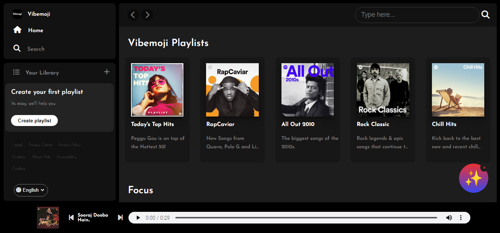
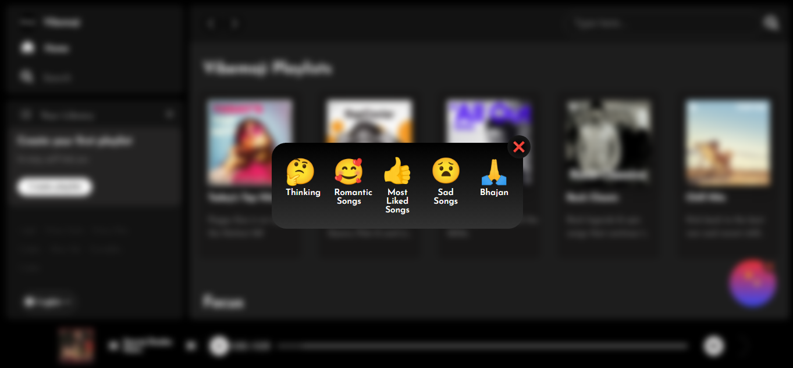
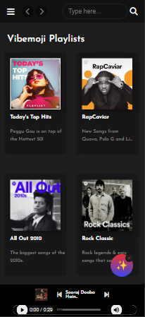

   #                                                              🎵🎼 Vibemoji 🎼🎵 -
Vibemoji is a revolutionary music discovery platform that allows users to search for songs based on their mood using emojis. This project was built using HTML, CSS, and JavaScript.

## Features

- Search for songs based on emojis representing different moods.
- Explore a wide range of music genres and artists.
- Intuitive user interface for seamless navigation and exploration.
- Responsive design for compatibility across various devices.

## Technologies Used

- HTML
- CSS
- JavaScript

## API Used 

iTunes

## Screenshots

###  Laptop View

 

###  Emojis Screenshot 

 

###  Mobile View

